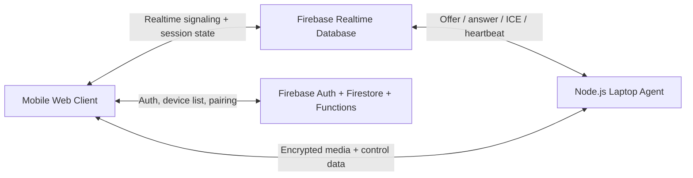

# FlowCast

FlowCast is a Firebase + WebRTC remote desktop MVP built for mobile-first control of a laptop over the public internet. It combines a responsive web controller, Firebase-authenticated device pairing, Realtime Database signaling, and a Node.js laptop agent that captures the desktop and injects mouse and keyboard input locally.

## What this MVP includes

- Mobile-first web client built with plain HTML, CSS, and JavaScript
- Firebase Auth email/password sign-in
- Secure 6-digit device pairing flow through Cloud Functions
- WebRTC screen streaming from the laptop agent to the browser
- Mouse and keyboard control over a WebRTC data channel
- Clipboard sync
- Screenshot capture
- Bi-directional file transfer over the data channel
- Low-data mode with adaptive frame rate and resolution
- Dark-mode UI
- Heartbeat-driven reconnect flow that only ends on manual disconnect

## Important constraint

This implementation uses free public STUN servers only, as requested. That keeps the stack fully free, but it also means some restrictive NAT or carrier networks may still fail to establish a direct WebRTC session. For truly universal connectivity, a TURN relay is normally required. The code is structured so a TURN server can be added later without changing the app architecture.

## Folder structure

```text
.
|-- .firebaserc.example
|-- agent/
|   |-- .env.example
|   |-- package.json
|   `-- src/
|       |-- config.js
|       |-- index.js
|       |-- protocol.js
|       `-- session-agent.js
|-- docs/
|   |-- architecture.md
|   |-- database-schema.md
|   |-- deployment.md
|   `-- testing.md
|-- functions/
|   |-- index.js
|   `-- package.json
|-- web/
|   `-- public/
|       |-- app.css
|       |-- config.js
|       |-- config.example.js
|       |-- images/
|       |-- index.html
|       `-- js/
|           |-- app.js
|           |-- firebase-app.js
|           |-- protocol.js
|           `-- remote-session.js
|-- database.rules.json
|-- firebase.json
|-- firestore.indexes.json
|-- firestore.rules
`-- package.json
```

## High-level architecture



## Setup summary

1. Create a Firebase project.
2. Enable Email/Password authentication.
3. Create both Firestore and Realtime Database.
4. Deploy the Functions and Hosting targets from this repo.
5. Fill in [web/public/config.example.js](/C:/Users/naman/OneDrive/Documents/New%20project%202/web/public/config.example.js) and [agent/.env.example](/C:/Users/naman/OneDrive/Documents/New%20project%202/agent/.env.example) with your Firebase values.
6. Run the laptop agent and pair it from the web UI.

## Shipping note

This repo uses Firebase Functions because secure pairing and device credential creation need a trusted backend. In practice, deployed Firebase Functions may require a billing-enabled Firebase project even if your actual usage stays within low or free quotas. The rest of the architecture stays within the free-tier-friendly stack you requested.

## Key design choices

- Firestore stores durable state such as linked devices and pairing records.
- Realtime Database carries live signaling, session state, and heartbeats.
- Cloud Functions enforce pairing, revoke, session creation, and rate limits.
- The browser always acts as the SDP offerer, which simplifies reconnects.
- The agent keeps sessions alive until the user explicitly disconnects.

## Docs

- Architecture: [docs/architecture.md](/C:/Users/naman/OneDrive/Documents/New%20project%202/docs/architecture.md)
- Database schema: [docs/database-schema.md](/C:/Users/naman/OneDrive/Documents/New%20project%202/docs/database-schema.md)
- Deployment guide: [docs/deployment.md](/C:/Users/naman/OneDrive/Documents/New%20project%202/docs/deployment.md)
- Testing guide: [docs/testing.md](/C:/Users/naman/OneDrive/Documents/New%20project%202/docs/testing.md)
